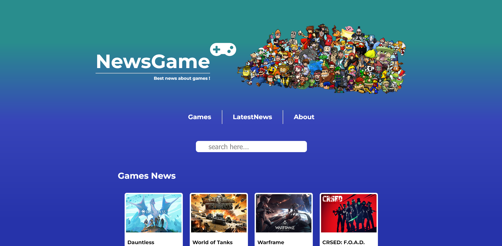

# Segundo projeto DevInHouse

Este é  os segundo projeto feito no curso DevInHouse

Tecnologias usadas:

* ReactJS
* StyledComponents
* LocalStorage
* API-Rest

Deploy: https://newsgamemmo.herokuapp.com/

